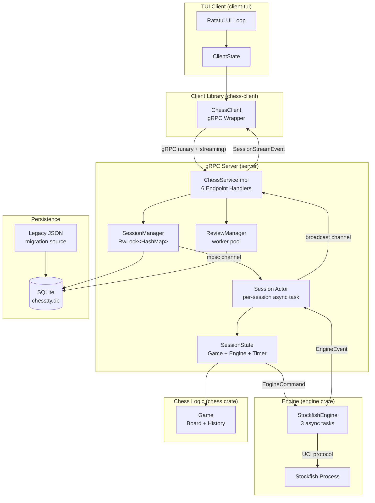

# ChessTTY - Terminal Chess with Stockfish Integration

A terminal-based chess application built in Rust, featuring a ratatui TUI client communicating with a gRPC game server that integrates the Stockfish chess engine.

## Architecture Overview

ChessTTY uses a **server-authoritative client-server architecture**. The server owns all game state, move validation, engine management, and timer logic. The client is a thin rendering layer that sends user actions via gRPC and reacts to server-pushed events.



### Design Principles

1. **Server-Authoritative** - All game state, move validation, engine control, and timer management live on the server. The client never validates moves or runs game logic.
2. **Actor Model** - Each game session runs as an isolated async task (actor) that owns all mutable state. No locks on game state; communication happens through channels.
3. **Snapshot-Based State** - Every state change produces a complete `SessionSnapshot`. No deltas or incremental updates. Clients can always reconstruct full state from a single event.
4. **Event-Driven** - The server pushes events to clients via gRPC server streaming. The client reacts to events and re-renders.
5. **Clean Boundaries** - Domain types and proto types are kept completely separate. Conversion happens only at the service layer.

## Stockfish Process Management

The `engine` crate manages Stockfish as a child process with three async tasks:

```
                    EngineCommand                 UCI string
┌────────────┐     (typed enum)     ┌───────────┐  (stdin)   ┌───────────┐
│ Session    │ ──────────────────>  │ Command   │ ────────>  │ Stdin     │ ──> Stockfish
│ Actor      │     mpsc channel     │ Processor │            │ Writer    │     stdin
└────────────┘                      └───────────┘            └───────────┘
      ^                                                            │
      │         EngineEvent                                        │ (emits RawUciMessage)
      │        (typed enum)         ┌───────────┐                  v
      └─────────────────────────── │ Output    │ <────────── Stockfish
               mpsc channel         │ Reader    │   stdout       stdout
                                    └───────────┘
```

1. **Output Reader** - Reads Stockfish stdout line-by-line, parses UCI messages (`bestmove`, `info`, `uciok`, etc.) into typed `EngineEvent` variants, and emits `RawUciMessage` events for the debug panel.
2. **Stdin Writer** - Receives string commands from an internal channel and writes them to Stockfish's stdin. Also emits `RawUciMessage` events for logging.
3. **Command Processor** - Receives typed `EngineCommand` enums (`SetPosition`, `Go`, `Stop`, etc.) and converts them to UCI protocol strings before forwarding to the stdin writer.

**Lifecycle**: On spawn, the engine sends `uci` and waits for `uciok` (10-second timeout), then configures `Skill Level`, `Threads`, and `Hash` via `setoption`. On shutdown, it sends `quit` and waits up to 1 second before killing the process.

**Auto-triggering**: The server automatically triggers engine moves based on game mode. In `HumanVsEngine`, the engine moves when it's the engine's turn. In `EngineVsEngine`, it moves after every position change. Search parameters scale with skill level (depth 4-8 for low skill, movetime 500-2000ms for higher skill).

## Event Architecture

Events flow from the engine process through the session actor to connected clients:

```
Stockfish stdout
    │
    ▼
EngineEvent (mpsc)
    │
    ▼
Session Actor ──── handles BestMove/Info/RawUci ────> SessionEvent (broadcast)
    │                                                       │
    │  (also receives SessionCommands                       ▼
    │   from gRPC endpoints via mpsc)               gRPC stream
    │                                               (SessionStreamEvent)
    ▼                                                       │
Timer tick (100ms interval)                                 ▼
                                                    Client: handle_event()
                                                        │
                                                        ▼
                                                    apply_snapshot()
                                                        │
                                                        ▼
                                                    UI re-render
```

### Session Actor Loop

The actor uses `tokio::select! { biased; }` with priority ordering:

1. **Commands** (highest) - `SessionCommand` from gRPC endpoints via `mpsc`. Each command carries a `oneshot::Sender` for the reply.
2. **Engine events** - `EngineEvent` from the Stockfish process via `mpsc`.
3. **Timer ticks** (lowest) - 100ms interval for decrementing the active player's clock. Only runs when a timer is active.

### Event Types

| Event | Description | Frequency |
|-------|-------------|-----------|
| `StateChanged(SessionSnapshot)` | Full state snapshot after any mutation | On every game action |
| `EngineThinking(EngineAnalysis)` | Transient analysis data (depth, score, PV) | 10+ per second during search |
| `UciMessage(UciLogEntry)` | Raw UCI protocol message for debug panel | Every engine I/O line |
| `Error(String)` | Error notification | On failures |

## gRPC Call Stack

### Protocol Structure

The protocol is defined in 10 `.proto` files organized by domain:

```
proto/proto/
├── chess_service.proto   # Service definition (imports all others)
├── common.proto          # Shared types: MoveRepr, MoveRecord, GamePhase, TimerState
├── session.proto         # SessionSnapshot, CreateSession, GetSession, CloseSession
├── game.proto            # MakeMove, GetLegalMoves, Undo, Redo, Reset
├── engine.proto          # SetEngine, StopEngine, EngineConfig
├── events.proto          # StreamEvents, SessionStreamEvent
├── persistence.proto     # Suspend, Resume, List, Delete sessions
├── positions.proto       # Save, List, Delete positions
├── review.proto          # Post-game review messages
└── advanced_review.proto # Advanced analysis types
```

### RPC Endpoints (28 total)

| Domain | RPCs | Pattern |
|--------|------|---------|
| Session | CreateSession, GetSession, CloseSession | Unary |
| Game | MakeMove, GetLegalMoves, UndoMove, RedoMove, ResetGame | Unary |
| Engine | SetEngine, StopEngine, PauseSession, ResumeSession | Unary |
| Persistence | SuspendSession, ListSuspendedSessions, ResumeSuspendedSession, DeleteSuspendedSession, SaveSnapshot | Unary |
| Positions | SavePosition, ListPositions, DeletePosition | Unary |
| Review | ListFinishedGames, EnqueueReview, GetReviewStatus, GetGameReview, ExportReviewPgn, DeleteFinishedGame | Unary |
| Advanced | GetAdvancedAnalysis | Unary |
| Events | StreamEvents | Server streaming |

**Key design choice**: There is no `TriggerEngineMove` RPC. The server auto-triggers engine moves based on game mode after every state change, keeping the client thin.

### Request/Response Flow

All game mutations follow the same pattern through the actor:

```mermaid
sequenceDiagram
    participant Client
    participant Service as gRPC Service
    participant Manager as SessionManager
    participant Actor as Session Actor

    Client->>Service: MakeMove(from, to)
    Service->>Manager: get_handle(session_id)
    Manager-->>Service: SessionHandle
    Service->>Actor: handle.make_move(mv) (mpsc + oneshot)
    Note over Actor: validate + apply move
    Note over Actor: broadcast StateChanged
    Note over Actor: maybe_auto_trigger()
    Actor-->>Service: SessionSnapshot
    Note over Service: convert domain snapshot to proto
    Service-->>Client: SessionSnapshot
```

### Event Streaming

The `StreamEvents` RPC returns a gRPC server stream. On subscribe, the client immediately receives the current `SessionSnapshot`, then receives events as they occur:

```protobuf
message SessionStreamEvent {
  string session_id = 1;
  oneof event {
    SessionSnapshot state_changed = 2;
    EngineAnalysis engine_thinking = 3;
    UciMessageEvent uci_message = 4;
    string error = 5;
  }
}
```

The server uses `tokio::broadcast::channel(100)`. If a client falls behind, it skips lagged events and re-syncs on the next `StateChanged`.

## Client-Server Interface

The `chess-client` crate wraps the gRPC client into a high-level async API. The TUI uses it to:

1. **Connect** to the server at `http://[::1]:50051` via `ChessClient::connect()`
2. **Create a session** with game mode, optional FEN, and optional timer
3. **Open an event stream** via `stream_events()` for real-time updates
4. **Send actions** (make_move, undo, set_engine, pause, etc.) as unary RPCs
5. **Handle events** via `poll_event_async()` which dispatches to `apply_snapshot()`, updating the local board and UI state

The client maintains a `ClientState` as a single source of truth for rendering. All updates flow through `apply_snapshot()`, which parses the FEN into a `cozy_chess::Board` for rendering and updates the game mode and pause state.

## Project Structure

```
chesstty/
├── proto/          # gRPC protocol definitions (10 .proto files)
├── server/         # Authoritative game server (actor model, session management)
├── chess-client/   # Reusable gRPC client library
├── client-tui/     # Terminal UI (ratatui + crossterm)
├── chess/          # Core chess logic (cozy-chess wrapper, FEN, SAN, game state)
├── engine/         # Stockfish UCI engine wrapper (async process management)
└── analysis/       # Post-game analysis (board analysis, tactics, advanced metrics)
```

See crate-level READMEs for detailed documentation:
- [server/README.md](server/README.md) - Actor model, session management, service layer
- [client-tui/README.md](client-tui/README.md) - UI render workflow, focus system, widget inventory
- [proto/README.md](proto/README.md) - Protocol definitions, message types, sequence diagrams
- [chess-client/README.md](chess-client/README.md) - Client library API
- [chess/README.md](chess/README.md) - Game logic, move generation, FEN handling
- [engine/README.md](engine/README.md) - Stockfish process management, UCI protocol
- [analysis/README.md](analysis/README.md) - Board analysis, tactics, king safety, advanced metrics

## Quick Start

### Prerequisites

- **Rust** (install via [rustup](https://rustup.rs))
- **Stockfish** chess engine ([download](https://stockfishchess.org))
- **just** command runner (optional, `cargo install just`)

### Running

```bash
# Terminal 1: Start server
just server
# or: cargo run -p chesstty-server

# Terminal 2: Start TUI client
just tui
# or: cargo run -p client-tui
```

### Development

```bash
just build          # Build all crates
just test           # Run all tests
just lint           # Run clippy lints
just stockfish      # Check Stockfish installation
```

## Features

### Game Modes
- **Human vs Human** - Two players on the same terminal
- **Human vs Engine** - Play against Stockfish (skill 0-20)
- **Engine vs Engine** - Watch Stockfish play itself
- **Post-Game Review** - Analyze completed games with engine evaluation

### Post-Game Review System

After each completed game, you can request an engine analysis to see how well you played. The review system evaluates every move and provides:

#### Accuracy Score
A percentage (0-100) representing how closely each player's moves matched the engine's recommendations. Calculated using:
```
accuracy = 103.1668 × e^(-0.006 × avg_cp_loss) - 3.1668
```
This exponential formula converts average centipawn loss into an accuracy percentage calibrated to match typical chess platforms:
- ACPL = 10 → ~94% accuracy
- ACPL = 35 → ~80% accuracy
- ACPL = 100 → ~54% accuracy

#### Move Classification
Every move is rated relative to the engine's best move:
- **Best** (0 cp loss) - Perfect play
- **Excellent** (1-10 cp) - Near-perfect
- **Good** (11-30 cp) - Solid move
- **Inaccuracy** (31-100 cp) - Suboptimal but playable
- **Mistake** (101-300 cp) - Serious error
- **Blunder** (300+ cp) - Game-losing error

**cp** = centipawn (1/100th of a pawn). A typical pawn is worth ~100 cp.

#### Evaluation Graph
A real-time visualization of position strength throughout the game:
- Shows who was winning at each point
- Highlights critical mistakes that swung the game
- Helps identify where the game was lost

#### What Gets Analyzed
- Every move in the game is evaluated at a fixed depth (typically 18 plies)
- The engine evaluates the position **before** each move to find the best move and best evaluation
- The position **after** each move is evaluated from the opponent's perspective
- Centipawn loss = how much worse the played move was than the best move
- Forced moves (only one legal move) are labeled as such and don't count as errors

### Capabilities
- **Session Persistence** - Suspend and resume games (SQLite-backed persistence with one-time JSON migration support)
- **Position Library** - Save and load custom FEN positions (with built-in defaults)
- **Real-time Engine Analysis** - Live depth, score, nodes/sec, and principal variation
- **Move History** - Complete history with undo/redo support
- **Timer Support** - Server-managed chess clocks with flag detection
- **UCI Debug Panel** - View raw Stockfish protocol messages
- **Adaptive Board Rendering** - Auto-sizes to terminal dimensions (Small/Medium/Large)
- **Post-Game Review** - Background engine analysis with accuracy scores, move classification, evaluation graphs, and annotated PGN export

### Code Quality
- Zero unsafe code (`unsafe_code = "forbid"`)
- Strict lints (`enum_glob_use = "deny"`)
- Structured tracing throughout

## Keyboard Shortcuts

### Game Mode
| Key | Action |
|-----|--------|
| Click/type square (e.g., `e2` then `e4`) | Select piece and make move |
| `i` | Activate typeahead move input |
| `p` | Pause/unpause game |
| `u` | Undo last move |
| `Tab` | Enter panel selection mode |
| `1`-`9` | Select panel by number |
| `@` | Toggle UCI debug panel |
| `Esc` | Open pause menu |
| `Ctrl+C` | Quit |

### Panel Selection Mode
| Key | Action |
|-----|--------|
| `h`/`l` or Left/Right | Navigate between columns |
| `j`/`k` or Up/Down | Navigate within column |
| `J`/`K` (Shift) | Scroll panel content |
| `Enter` | Expand panel to fill board area |
| `Esc` | Return to board |

### Review Mode
| Key | Action |
|-----|--------|
| `j`/`k` or arrows | Navigate through moves |
| `Space` | Toggle auto-play (750ms per move) |
| `Home`/`End` | Jump to first/last move |
| `n`/`p` | Jump to next/previous critical moment |
| `Esc` | Return to menu |

### Start Screen / Match Summary
| Key | Action |
|-----|--------|
| `Enter` | Select menu item / Return to menu |
| `n` | New game (match summary) |
| `q` | Quit |

## Troubleshooting

1.  **Stockfish not found**: The engine crate searches `/usr/local/bin`, `/usr/bin`, `/opt/homebrew/bin`, `/usr/games`, and then the system `PATH`. You can install it via `just stockfish` (which runs `scripts/install-stockfish.sh`) or `brew install stockfish` on macOS.

2.  **Server connection refused**: Ensure the server is running before the client (`just server`). It binds to `[::1]:50051` (IPv6 localhost). The connection will fail if your system has IPv6 disabled.

3.  **Build fails on proto compilation**: The project requires the `protoc` compiler for its gRPC services. You can install it via `brew install protobuf` on macOS or `apt install protobuf-compiler` on Linux.

4.  **Terminal rendering issues**: The TUI requires a terminal emulator that supports at least 256 colors and Unicode characters. The board display adapts to different terminal sizes (Small, Medium, Large), but the minimum recommended size is 80x24.

## Configuration

See [server/CONFIGURATION.md](server/CONFIGURATION.md) for data directory configuration, environment variables, and deployment options.

## License

MIT License - see LICENSE file for details.

## Acknowledgments

- [cozy-chess](https://github.com/analog-hors/cozy-chess) - Fast chess move generation
- [Stockfish](https://stockfishchess.org) - World's strongest chess engine
- [tonic](https://github.com/hyperium/tonic) - gRPC for Rust
- [ratatui](https://github.com/ratatui/ratatui) - Terminal UI framework
