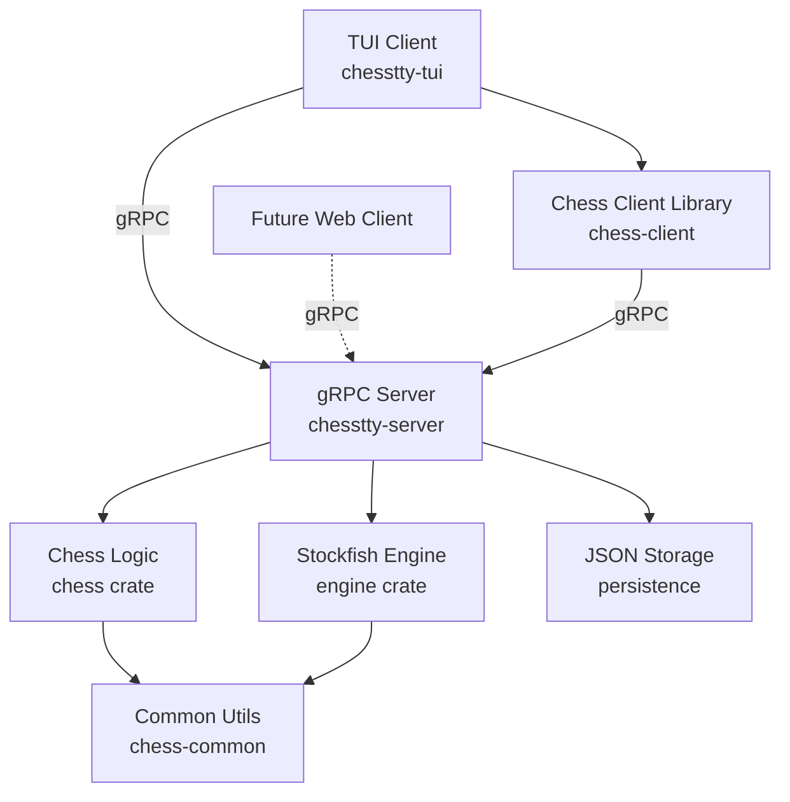

# ChessTTY - Terminal Chess with Stockfish Engine

A high-performance chess application featuring a terminal UI client and gRPC server with Stockfish engine integration.

## Architecture Overview

ChessTTY follows a **client-server architecture** where the server is authoritative:



### Key Design Principles

1. **Server-Authoritative:** All game state and validation lives on the server
2. **Thin Client:** UI is purely presentational, no business logic
3. **Event-Driven:** Server pushes events to clients via gRPC streaming
4. **Modular:** Clean separation of concerns across 7 workspace crates
5. **Extensible:** Architecture supports multiple client types (web, mobile, etc.)

## Project Structure

```
chesstty/
├── proto/              # gRPC protocol definitions (7 modular .proto files)
├── server/             # Authoritative game server (session management, validation)
├── chess-client/       # Reusable gRPC client library
├── client-tui/         # Terminal UI implementation (ratatui)
├── chess/              # Core chess game logic (move generation, validation)
├── engine/             # Stockfish UCI engine wrapper (multithreaded)
└── chess-common/       # Shared utilities (converters, UCI helpers)
```

## Quick Start

### Prerequisites

- **Rust 1.70+** (install via [rustup](https://rustup.rs))
- **Stockfish** chess engine ([download](https://stockfishchess.org))

### Installation

```bash
# Clone repository
git clone https://github.com/yourusername/chesstty
cd chesstty

# Build workspace
cargo build --release

# Install Stockfish (if not already installed)
./scripts/install-stockfish.sh
```

### Running

```bash
# Terminal 1: Start server
cargo run --release --bin chesstty-server

# Terminal 2: Start TUI client
cargo run --release --bin chesstty-tui

# Or use simple UI mode
cargo run --release --bin chesstty-tui -- --simple
```

## Features

### Gameplay Modes
- **Human vs Human** - Two players on same machine
- **Human vs Engine** - Play against Stockfish (configurable skill 0-20)
- **Engine vs Engine** - Watch Stockfish play itself

### Advanced Features
- **Session Persistence** - Suspend and resume games
- **Position Library** - Save and load custom positions
- **Real-time Analysis** - Live engine evaluation and principal variation
- **Move History** - Complete game history with undo/redo
- **FEN Support** - Set up custom positions via Forsyth-Edwards Notation
- **UCI Debug Panel** - View raw engine communication

### Technical Features
- **Event Streaming** - Real-time updates via gRPC server-sent events
- **Multithreaded Engine** - Parallel Stockfish analysis
- **JSON Persistence** - Save games and positions to disk
- **Comprehensive Logging** - Structured tracing for debugging

## Architecture Documentation

For detailed architecture information, see:

- **[proto/README.md](proto/README.md)** - Protocol definitions and sequence diagrams
- **[server/README.md](server/README.md)** - Server architecture and components
- **[chess-client/README.md](chess-client/README.md)** - Client library API
- **[client-tui/README.md](client-tui/README.md)** - TUI implementation details

## Development

### Building from Source

```bash
# Build all crates
cargo build --workspace

# Build optimized release
cargo build --workspace --release

# Run tests
cargo test --workspace

# Run linter
cargo clippy --workspace -- -D warnings
```

### Workspace Structure

This is a Cargo workspace with 7 crates:

| Crate | Description | Lines of Code |
|-------|-------------|---------------|
| `proto` | gRPC protocol definitions | Protocol buffers |
| `server` | Game server implementation | ~2,000 |
| `chess-client` | Reusable client library | ~300 |
| `client-tui` | Terminal UI | ~6,000 |
| `chess` | Chess game logic | ~1,200 |
| `engine` | Stockfish integration | ~800 |
| `chess-common` | Shared utilities | ~400 |

### Code Quality

- **Zero unsafe code** - All code is safe Rust
- **Comprehensive tests** - 87 unit and integration tests
- **Strict lints** - Enforced via workspace lints
- **Structured logging** - Tracing throughout

## Protocol

ChessTTY uses gRPC for client-server communication:

- **19 RPC endpoints** organized by domain (session, game, engine, persistence, positions)
- **6 event types** for real-time updates (moves, engine thinking, game end, errors)
- **Bidirectional streaming** for live game events
- **Language-agnostic** protocol enables clients in any language

See [proto/README.md](proto/README.md) for detailed protocol documentation.

## Contributing

1. Fork the repository
2. Create a feature branch (`git checkout -b feature/amazing-feature`)
3. Make your changes and add tests
4. Run `cargo test --workspace` and `cargo clippy --workspace`
5. Commit your changes (`git commit -m 'Add amazing feature'`)
6. Push to the branch (`git push origin feature/amazing-feature`)
7. Open a Pull Request

### Development Guidelines

- Follow Rust idioms and conventions
- Add tests for new functionality
- Update documentation for API changes
- Keep commits atomic and descriptive
- Ensure clippy passes with zero warnings

## License

MIT License - see LICENSE file for details

## Acknowledgments

- **cozy-chess** - Fast chess move generation library
- **Stockfish** - World's strongest chess engine
- **tonic** - Excellent gRPC implementation for Rust
- **ratatui** - Terminal UI framework

## Future Roadmap

- [ ] Web UI client (React + gRPC-Web)
- [ ] PGN import/export
- [ ] Opening book integration
- [ ] Time controls (Fischer, delay, increment)
- [ ] Match/tournament mode
- [ ] PostgreSQL persistence option
- [ ] Cloud deployment support

---

**Built with ❤️ in Rust** | [Documentation](docs/) | [Report Bug](https://github.com/yourusername/chesstty/issues)
