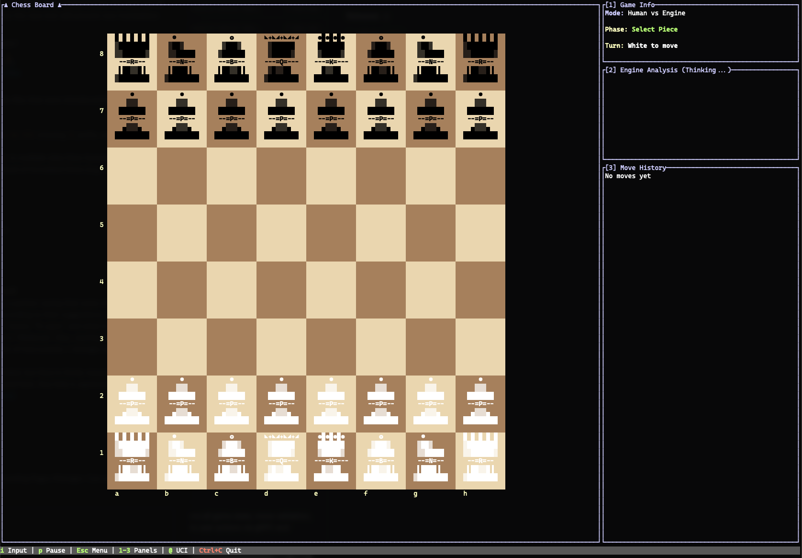

# ChessTTY

A terminal chess application built in Rust. Play against Stockfish, watch engine-vs-engine games, or play locally with a friend — all from your terminal.



## Quick Start

### Prerequisites

- **Rust** (install via [rustup](https://rustup.rs))
- **Stockfish** chess engine ([download](https://stockfishchess.org))
- **mise** (optional, for local development) — handles non-Rust dependencies like `protoc`, `just`, and `git-cliff`. Install via [mise.jdx.dev](https://mise.jdx.dev), then run `mise install` in the repo root.

### Running

```bash
# Single-command startup (recommended)
cargo run -p chesstty
```

## Features

- **Human vs Human** — two players on the same terminal
- **Human vs Engine** — play against Stockfish (skill 0-20)
- **Engine vs Engine** — watch Stockfish play itself
- **Post-Game Review** — accuracy scores, move classification, evaluation graphs
- **Session Persistence** — suspend and resume games (SQLite-backed)
- **Position Library** — save and load custom FEN positions
- **Theme Switching** — dark/light themes via `Ctrl+T` or `CHESSTTY_THEME=light`
- **Adaptive Rendering** — auto-sizes board to terminal dimensions

## Keyboard Shortcuts

| Key                                        | Action                        |
| ------------------------------------------ | ----------------------------- |
| Click or type square (e.g. `e2` then `e4`) | Select piece and make move    |
| `i`                                        | Activate typeahead move input |
| `p`                                        | Pause/unpause game            |
| `u`                                        | Undo last move                |
| `1`-`4`                                    | Toggle panels                 |
| `Ctrl+T`                                   | Toggle dark/light theme       |
| `Esc`                                      | Open menu                     |
| `Ctrl+C`                                   | Quit                          |

See [ARCHITECTURE.md](ARCHITECTURE.md) for the full keyboard reference and technical documentation.

## Troubleshooting

### Pieces appear grey or discolored on certain squares

Some terminal emulators (e.g. iTerm2) have a **Minimum Contrast** setting that adjusts foreground colors to ensure readability against the background. Because chess pieces are drawn as bright white on light-colored squares, the terminal may darken them to increase contrast — making white pieces appear grey on light squares while looking correct on dark squares.

**Fix:** Disable or lower the minimum contrast setting in your terminal:

- **iTerm2**: Preferences > Profiles > Colors > set "Minimum Contrast" to 0
- **Other terminals**: Look for a similar contrast or color adjustment setting

### Stockfish not found

The engine searches `/usr/local/bin`, `/usr/bin`, `/opt/homebrew/bin`, `/usr/games`, and the system `PATH`. Install via `brew install stockfish` on macOS or your package manager on Linux.

### Server connection failed

Ensure the server is running before the client. The single-command startup (`cargo run -p chesstty`) handles this automatically. If running manually, start the server first. The default socket is `/tmp/chesstty.sock`.

### Build fails on proto compilation

The project requires the `protoc` compiler. Install via `brew install protobuf` on macOS or `apt install protobuf-compiler` on Linux.

## Architecture

See [ARCHITECTURE.md](ARCHITECTURE.md) for the full technical documentation, including the server-authoritative design, actor model, gRPC protocol, and crate structure.

## License

MIT License - see LICENSE file for details.
