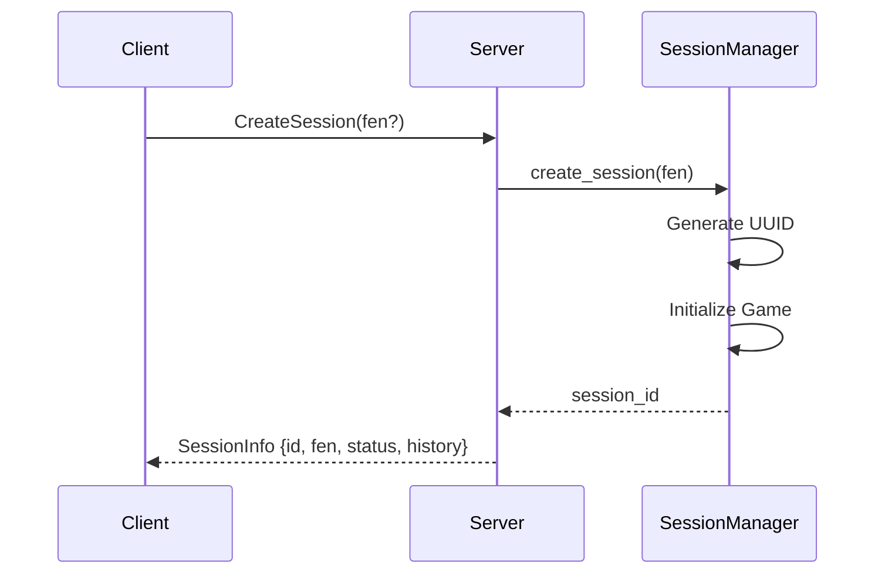
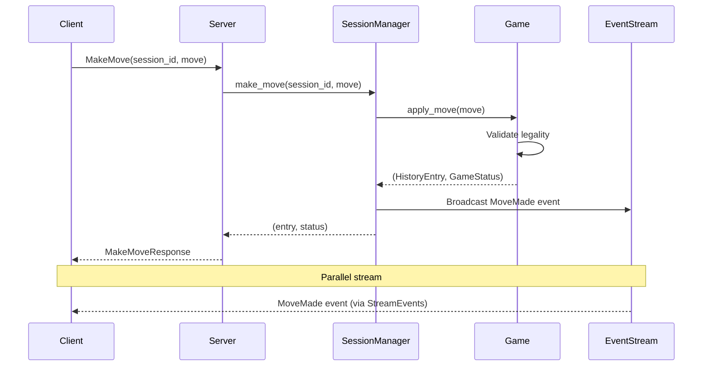
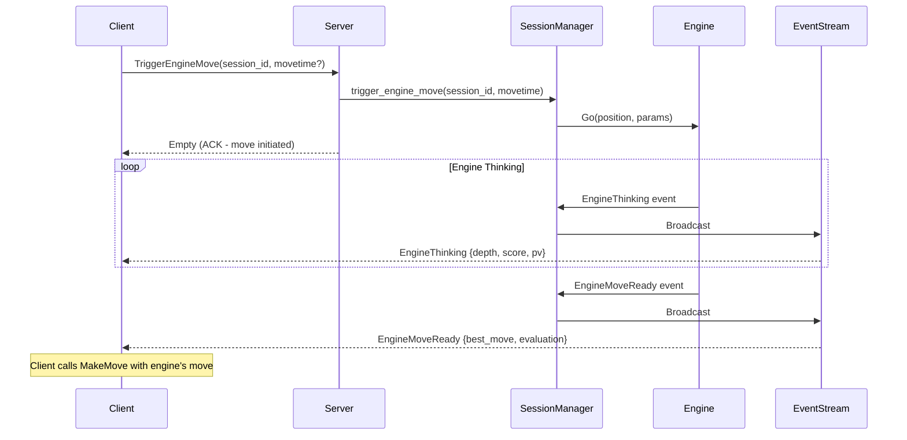
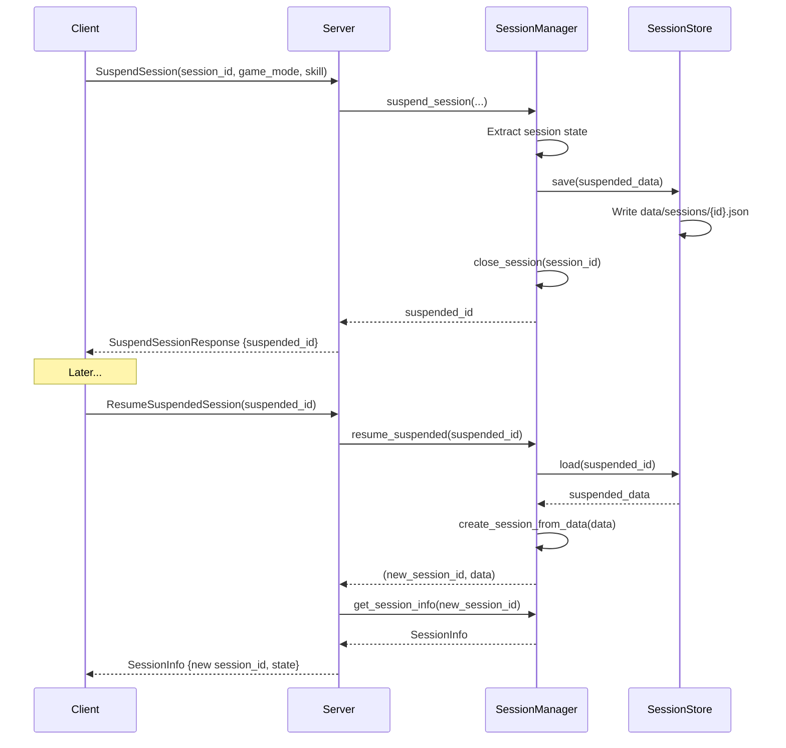

# chess-proto - gRPC Protocol Definitions

Protocol buffer definitions for the ChessTTY chess server, organized into modular domain-focused files.

## File Structure

Protocol definitions are split by domain for maintainability and clarity:

```
proto/proto/
├── common.proto          # Shared data types (Move, GameStatus, EngineInfo)
├── session.proto         # Session management (Create, Get, Close)
├── game.proto            # Game actions (MakeMove, Undo/Redo, Reset)
├── engine.proto          # Engine control (SetEngine, TriggerMove, Stop)
├── events.proto          # Event streaming (server → client push)
├── persistence.proto     # Session suspend/resume
├── positions.proto       # Saved position management
└── chess_service.proto   # Main service definition (imports all above)
```

## Service Overview

**ChessService** provides 19 RPC endpoints across 6 domains:

| Domain | RPCs | Description |
|--------|------|-------------|
| Session | 3 | CreateSession, GetSession, CloseSession |
| Game | 5 | MakeMove, GetLegalMoves, Undo, Redo, Reset |
| Engine | 3 | SetEngine, TriggerEngineMove, StopEngine |
| Events | 1 | StreamEvents (server streaming) |
| Persistence | 4 | Suspend, Resume, List, Delete suspended sessions |
| Positions | 3 | Save, List, Delete positions |

## Data Flow Diagrams

### Session Creation Flow



### Move Making Flow



### Engine Move Flow



### Session Suspend/Resume Flow



## Message Design Patterns

### Request-Response Pattern

Used for: Session management, game actions, configuration

```protobuf
// Request always contains session_id (except CreateSession)
message MakeMoveRequest {
  string session_id = 1;
  MoveRepr move = 2;
}

// Response returns updated state
message MakeMoveResponse {
  SessionInfo session_info = 1;
  MoveRecord move_record = 2;
}
```

### Server Streaming Pattern

Used for: Real-time event notifications

```protobuf
// Single request to establish stream
rpc StreamEvents(StreamEventsRequest) returns (stream GameEvent);

// Server pushes events as they occur
message GameEvent {
  oneof event {
    MoveMadeEvent move_made = 1;
    EngineMoveReadyEvent engine_move_ready = 2;
    EngineThinkingEvent engine_thinking = 3;
    GameEndedEvent game_ended = 4;
    ErrorEvent error = 5;
    UciMessageEvent uci_message = 6;
  }
}
```

## Core Data Types

### MoveRepr - Move Representation

Simple from-to notation:

```protobuf
message MoveRepr {
  string from = 1;        // "e2"
  string to = 2;          // "e4"
  optional string promotion = 3;  // "q", "r", "b", "n"
}
```

### MoveRecord - Complete Move Information

Includes piece, capture, SAN notation:

```protobuf
message MoveRecord {
  string from = 1;         // "e2"
  string to = 2;           // "e4"
  string piece = 3;        // "P" (Pawn)
  optional string captured = 4;  // "N" (Knight) if capture
  string san = 5;          // "e4" or "Nxd5"
  string fen_after = 6;    // FEN position after move
  optional string promotion = 7;
}
```

### SessionInfo - Complete Session State

```protobuf
message SessionInfo {
  string session_id = 1;
  string fen = 2;
  string side_to_move = 3;     // "white" | "black"
  GameStatus status = 4;        // ONGOING | WON | DRAWN
  uint32 move_count = 5;
  repeated MoveRecord history = 6;
  optional EngineConfig engine_config = 7;
}
```

### EngineInfo - Real-time Engine Analysis

```protobuf
message EngineInfo {
  optional uint32 depth = 1;        // Search depth
  optional uint32 seldepth = 2;     // Selective depth
  optional uint64 time_ms = 3;      // Time spent
  optional uint64 nodes = 4;        // Nodes searched
  optional string score = 5;        // "cp 25" or "mate 5"
  repeated string pv = 6;           // Principal variation
  optional uint64 nps = 7;          // Nodes per second
}
```

## Building

Protocol buffers are compiled automatically by `build.rs` using tonic-build:

```bash
# Compile proto files
cargo build --package chess-proto

# Generated code location
target/debug/build/chess-proto-*/out/
```

## Adding New RPCs

1. **Add message definitions** to appropriate proto file (e.g., `game.proto`)
2. **Add RPC to service** in `chess_service.proto`
3. **Rebuild proto:** `cargo build --package chess-proto`
4. **Implement server:** Add handler in `server/src/service/`
5. **Add client method:** Update `chess-client/src/client.rs`
6. **Update docs:** Document the new RPC here

## Protocol Versioning

Currently **v0.1.0 (unstable)**. Breaking changes allowed during development.

Future: Use gRPC API versioning when protocol stabilizes (v1.0.0).

## gRPC-Web Support

The protocol is designed to support web clients via gRPC-Web:

```rust
// server/src/main.rs
Server::builder()
    .accept_http1(true)  // Enable HTTP/1.1 for gRPC-Web
    .add_service(tonic_web::enable(ChessServiceServer::new(service)))
    .serve(addr)
    .await?;
```

Web clients can use:
- **grpc-web** (JavaScript/TypeScript)
- **@improbable-eng/grpc-web**
- **Envoy proxy** for full gRPC-Web support

## Error Handling

All RPCs return `tonic::Status` on error:

| Status Code | Usage |
|-------------|-------|
| `INVALID_ARGUMENT` | Bad request (invalid FEN, illegal move, bad format) |
| `NOT_FOUND` | Session/position doesn't exist |
| `INTERNAL` | Server error (should not happen) |
| `UNAVAILABLE` | Server temporarily unavailable |

Example error:
```
Status { code: InvalidArgument, message: "Invalid square: z9" }
```

## Performance Considerations

- **Message Size:** SessionInfo can be large with long game history
- **Event Rate:** EngineThinking events can fire rapidly (10+ per second)
- **Client Buffering:** Clients should buffer events to avoid backpressure
- **Lagging Handling:** Server drops events if client lags (broadcast channel)

## Security Considerations

Current implementation has **no authentication**. For production:

1. Add TLS certificates
2. Implement authentication (JWT, mTLS, API keys)
3. Add rate limiting per client
4. Validate all inputs server-side
5. Add audit logging

## Related Documentation

- [Server Architecture](../server/README.md)
- [Client Library API](../chess-client/README.md)
- [Chess Logic](../chess/README.md)
