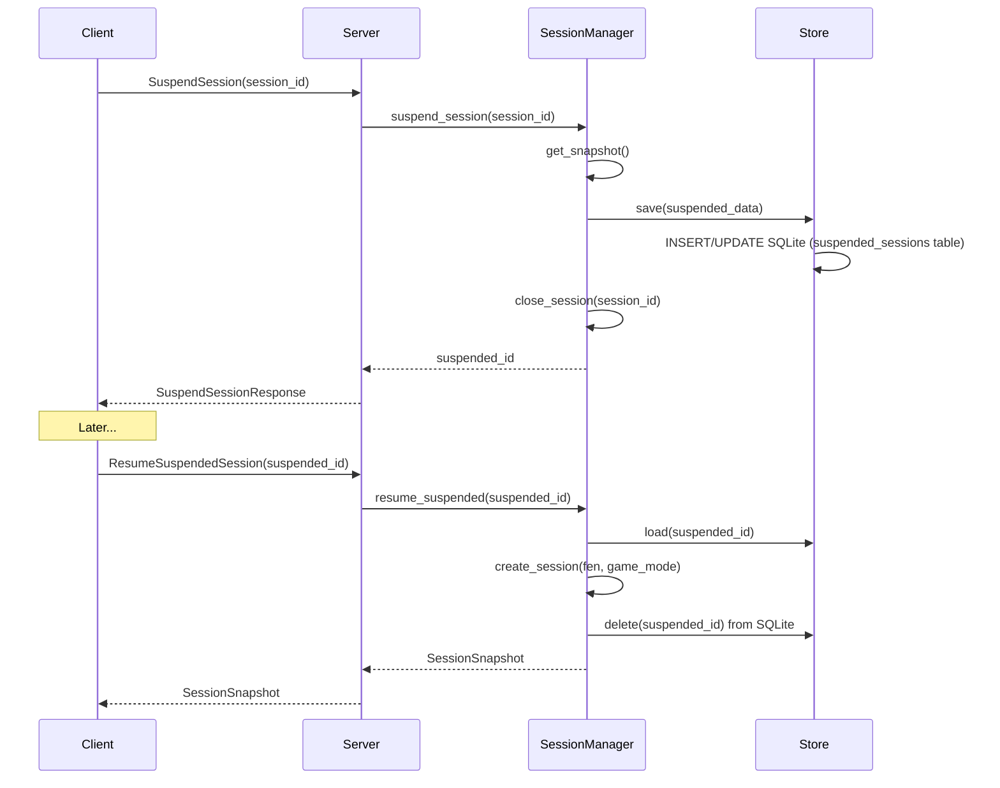

# chess-proto - gRPC Protocol Definitions

Protocol buffer definitions for the ChessTTY chess server. The protocol is organized into domain-focused files and compiled to Rust types via `tonic-build`.

## File Structure

```
proto/proto/
├── chess_service.proto   # Main service definition (28 RPCs, imports all others)
├── common.proto          # Shared types used across domains
├── session.proto         # Session lifecycle messages + SessionSnapshot
├── game.proto            # Game action messages (moves, undo, redo, reset)
├── engine.proto          # Engine configuration messages
├── events.proto          # Event streaming messages
├── persistence.proto     # Session suspend/resume messages
├── positions.proto       # Saved position management messages
├── review.proto          # Post-game review messages
└── advanced_review.proto   # Advanced analysis (tactics, king safety, patterns)
```

## Service Definition

`ChessService` provides 28 RPC endpoints:

| Domain | RPC | Request -> Response | Type |
|--------|-----|-------------------|------|
| **Session** | CreateSession | CreateSessionRequest -> SessionSnapshot | Unary |
| | GetSession | GetSessionRequest -> SessionSnapshot | Unary |
| | CloseSession | CloseSessionRequest -> Empty | Unary |
| **Game** | MakeMove | MakeMoveRequest -> SessionSnapshot | Unary |
| | GetLegalMoves | GetLegalMovesRequest -> LegalMovesResponse | Unary |
| | UndoMove | UndoMoveRequest -> SessionSnapshot | Unary |
| | RedoMove | RedoMoveRequest -> SessionSnapshot | Unary |
| | ResetGame | ResetGameRequest -> SessionSnapshot | Unary |
| **Engine** | SetEngine | SetEngineRequest -> Empty | Unary |
| | StopEngine | StopEngineRequest -> Empty | Unary |
| | PauseSession | PauseSessionRequest -> Empty | Unary |
| | ResumeSession | ResumeSessionRequest -> Empty | Unary |
| **Persistence** | SuspendSession | SuspendSessionRequest -> SuspendSessionResponse | Unary |
| | ListSuspendedSessions | ListSuspendedSessionsRequest -> ListSuspendedSessionsResponse | Unary |
| | ResumeSuspendedSession | ResumeSuspendedSessionRequest -> SessionSnapshot | Unary |
| | DeleteSuspendedSession | DeleteSuspendedSessionRequest -> Empty | Unary |
| | SaveSnapshot | SaveSnapshotRequest -> SaveSnapshotResponse | Unary |
| **Positions** | SavePosition | SavePositionRequest -> SavePositionResponse | Unary |
| | ListPositions | ListPositionsRequest -> ListPositionsResponse | Unary |
| | DeletePosition | DeletePositionRequest -> Empty | Unary |
| **Review** | ListFinishedGames | ListFinishedGamesRequest -> ListFinishedGamesResponse | Unary |
| | EnqueueReview | EnqueueReviewRequest -> EnqueueReviewResponse | Unary |
| | GetReviewStatus | GetReviewStatusRequest -> GetReviewStatusResponse | Unary |
| | GetGameReview | GetGameReviewRequest -> GetGameReviewResponse | Unary |
| | ExportReviewPgn | ExportReviewPgnRequest -> ExportReviewPgnResponse | Unary |
| | DeleteFinishedGame | DeleteFinishedGameRequest -> Empty | Unary |
| **Advanced** | GetAdvancedAnalysis | GetAdvancedAnalysisRequest -> GetAdvancedAnalysisResponse | Unary |
| **Events** | StreamEvents | StreamEventsRequest -> **stream** SessionStreamEvent | Server streaming |

**Notable**: There is no `TriggerEngineMove` RPC. The server auto-triggers engine moves based on game mode.

## Core Message Types

### SessionSnapshot (primary state carrier)

The central message returned by most RPCs and pushed via event streaming:

```protobuf
message SessionSnapshot {
  string session_id = 1;
  string fen = 2;                        // Current position in FEN
  string side_to_move = 3;               // "white" or "black"
  GamePhase phase = 4;                   // GAME_PHASE_SETUP | GAME_PHASE_PLAYING | GAME_PHASE_PAUSED | GAME_PHASE_ENDED | GAME_PHASE_ANALYZING
  GameStatus status = 5;                 // ONGOING | WON | DRAWN
  uint32 move_count = 6;
  repeated MoveRecord history = 7;       // Complete move history
  optional LastMove last_move = 8;       // From/to of most recent move
  optional EngineAnalysis analysis = 9;  // Latest engine analysis
  optional EngineConfig engine_config = 10;
  optional GameModeProto game_mode = 11; // HvH, HvE, EvE, Analysis, Review
  bool engine_thinking = 12;            // Whether engine is currently calculating
  optional TimerState timer = 13;        // Chess clock state
}
```

### Move Types

```protobuf
// Client sends this to make a move
message MoveRepr {
  string from = 1;              // e.g., "e2"
  string to = 2;                // e.g., "e4"
  optional string promotion = 3; // "q", "r", "b", "n"
}

// Server returns this in history
message MoveRecord {
  string from = 1;
  string to = 2;
  string piece = 3;             // "P", "N", "B", "R", "Q", "K"
  optional string captured = 4;
  string san = 5;               // Standard algebraic: "e4", "Nxd5", "O-O"
  string fen_after = 6;
  optional string promotion = 7;
  optional uint64 clock_ms = 8;          // Remaining time for mover (if timers enabled)
}

// Server returns this for legal move queries
message MoveDetail {
  string from = 1;
  string to = 2;
  optional string promotion = 3;
  string san = 4;
  bool is_capture = 5;
  bool is_check = 6;
  bool is_checkmate = 7;
}
```

### Enums

```protobuf
enum GamePhase    { GAME_PHASE_SETUP=0, GAME_PHASE_PLAYING=1, GAME_PHASE_PAUSED=2, GAME_PHASE_ENDED=3, GAME_PHASE_ANALYZING=4 }
enum GameStatus   { ONGOING=0, WON=1, DRAWN=2 }
enum GameModeType { HUMAN_VS_HUMAN=0, HUMAN_VS_ENGINE=1, ENGINE_VS_ENGINE=2, ANALYSIS=3, REVIEW=4 }
```

## Event Streaming

The `StreamEvents` RPC returns a server stream of `SessionStreamEvent`:

```protobuf
message SessionStreamEvent {
  string session_id = 1;
  oneof event {
    SessionSnapshot state_changed = 2;    // Full state after any mutation
    EngineAnalysis engine_thinking = 3;   // Transient analysis data
    UciMessageEvent uci_message = 4;      // Raw UCI protocol message
    string error = 5;                     // Error notification
  }
}
```

On subscribe, the first event is always a `state_changed` with the current snapshot.

## Sequence Diagrams

### Session Creation

```mermaid
sequenceDiagram
    participant Client
    participant Server
    participant SessionManager
    participant Actor

    Client->>Server: CreateSession(fen?, game_mode?, timer?)
    Server->>SessionManager: create_session(fen, game_mode)
    SessionManager->>SessionManager: Generate UUID
    SessionManager->>SessionManager: Create Game + channels
    SessionManager->>Actor: tokio::spawn(run_session_actor)
    SessionManager->>SessionManager: Store SessionHandle
    SessionManager-->>Server: SessionSnapshot
    Server-->>Client: SessionSnapshot
```

### Making a Move (Human vs Engine)

```mermaid
sequenceDiagram
    participant Client
    participant Server
    participant Actor
    participant Engine

    Client->>Server: MakeMove(session_id, "e2", "e4")
    Server->>Actor: SessionCommand::MakeMove (via mpsc)
    Actor->>Actor: state.apply_move()
    Actor->>Client: broadcast StateChanged
    Actor-->>Server: reply SessionSnapshot (via oneshot)
    Server-->>Client: SessionSnapshot

    Note over Actor: maybe_auto_trigger()
    Actor->>Engine: SetPosition(fen) + Go(params)

    loop Engine Analysis
        Engine->>Actor: EngineEvent::Info
        Actor->>Client: broadcast EngineThinking
    end

    Engine->>Actor: EngineEvent::BestMove
    Actor->>Actor: state.apply_move(engine_move)
    Actor->>Client: broadcast StateChanged
```

### Suspend and Resume



## Error Handling

All RPCs return `tonic::Status` on error:

| Status Code | Scenarios |
|-------------|-----------|
| `INVALID_ARGUMENT` | Invalid FEN, illegal move, bad square format, skill out of range |
| `NOT_FOUND` | Session or position doesn't exist |
| `INTERNAL` | Server error (channel closed, engine failure) |

## Building

Proto files are compiled automatically by `build.rs` using `tonic-build`:

```bash
cargo build -p chess-proto
```

Generated Rust code appears in `target/debug/build/chess-proto-*/out/` and is included via `tonic::include_proto!("chess")`.
