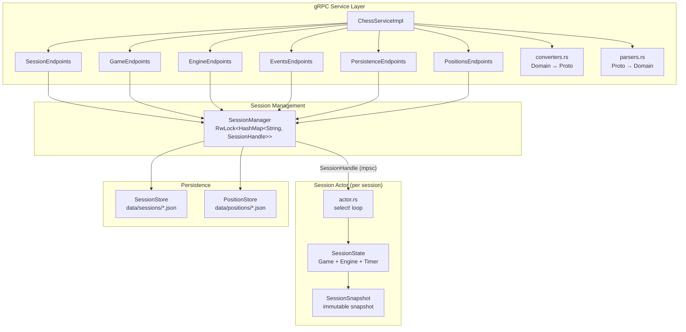

# chesstty-server - Authoritative Chess Game Server

The gRPC server that owns all game state. Manages sessions via the actor model, validates moves, controls Stockfish engines, manages timers, and broadcasts events to connected clients.

## Architecture

The server follows an **actor-per-session** architecture. Each game session runs as an isolated async task that owns all mutable state, communicating exclusively through channels.



## Module Structure

```
server/src/
├── main.rs                    # Server startup, tracing init, gRPC server bind
├── config.rs                  # Data directory and defaults directory resolution
├── persistence.rs             # SessionStore, PositionStore (JSON file I/O)
├── service/
│   ├── mod.rs                 # ChessServiceImpl (delegates to endpoint handlers)
│   ├── converters.rs          # Domain ↔ Proto type conversions
│   ├── parsers.rs             # Proto → Domain parsing with validation
│   └── endpoints/
│       ├── session.rs         # CreateSession, GetSession, CloseSession
│       ├── game.rs            # MakeMove, GetLegalMoves, Undo, Redo, Reset
│       ├── engine.rs          # SetEngine, StopEngine, Pause, Resume
│       ├── events.rs          # StreamEvents (gRPC server streaming)
│       ├── persistence.rs     # Suspend, Resume, List, Delete suspended
│       └── positions.rs       # SavePosition, ListPositions, DeletePosition
└── session/
    ├── mod.rs                 # SessionManager (session lifecycle + stores)
    ├── actor.rs               # Session actor loop (select!, command/event handling)
    ├── commands.rs            # SessionCommand enum, SessionError, EngineConfig, LegalMove
    ├── events.rs              # SessionEvent enum, UciLogEntry, UciDirection
    ├── handle.rs              # SessionHandle (cheap clone, mpsc + oneshot)
    ├── snapshot.rs            # SessionSnapshot, MoveRecord, TimerSnapshot
    └── state.rs               # SessionState (mutable state), TimerState
```

## Actor Model

### Session Lifecycle

```
CreateSession
    │
    ▼
SessionManager::create_session()
    │── Generate UUID
    │── Create Game from FEN (or default)
    │── Create mpsc channel (commands) + broadcast channel (events)
    │── Create SessionState
    │── tokio::spawn(run_session_actor)
    │── Store SessionHandle in HashMap
    └── Return initial SessionSnapshot

CloseSession / SuspendSession
    │
    ▼
SessionManager removes handle from HashMap
    │── handle.shutdown()
    │── Actor sends EngineCommand::Quit to Stockfish
    │── Actor loop breaks
    └── Actor task exits
```

### Actor Loop (select! with biased priority)

The actor runs a `tokio::select! { biased; }` loop with three branches:

```rust
loop {
    tokio::select! {
        biased;

        // 1. Commands from gRPC endpoints (highest priority)
        cmd = cmd_rx.recv() => { handle_command(cmd) }

        // 2. Engine events from Stockfish process
        event = state.next_engine_event() => { handle_engine_event(event) }

        // 3. Timer tick (100ms, only when timer is active)
        _ = timer_interval.tick(), if state.timer_active() => { tick_timer() }
    }
}
```

**Priority ordering matters**: Commands are processed first so that user actions (like `Stop` or `Pause`) take effect before pending engine events.

### Command/Reply Pattern

Every command embeds a `oneshot::Sender` for its reply, creating a request/response pattern over channels:

```
gRPC Endpoint                SessionHandle              Session Actor
     │                            │                          │
     │── handle.make_move(mv) ──>│                          │
     │                            │── create oneshot ────────│
     │                            │── send SessionCommand ──>│
     │                            │   {mv, reply: tx}        │
     │                            │                          │── state.apply_move(mv)
     │                            │                          │── event_tx.send(StateChanged)
     │                            │                          │── maybe_auto_trigger()
     │                            │<── reply via oneshot ────│
     │<── Result<Snapshot> ──────│                          │
```

### Engine Event Handling

| Engine Event | Actor Response |
|-------------|----------------|
| `BestMove(mv)` | Convert UCI castling notation, validate legality, apply move, broadcast `StateChanged`, call `maybe_auto_trigger()` for EvE chaining |
| `Info(info)` | Convert to `EngineAnalysis`, store in state, broadcast `EngineThinking` |
| `RawUciMessage` | Broadcast as `UciMessage` for the debug panel |
| `Ready` | Log only (readyok/uciok) |
| `Error(msg)` | Log error, broadcast `Error` event |

### Auto-Trigger Logic

After every state mutation, `maybe_auto_trigger()` checks if the engine should calculate a move:

```
should_auto_trigger_engine() =
    !engine_thinking
    AND phase == Playing
    AND engine is Some
    AND game status == Ongoing
    AND (mode == EngineVsEngine
         OR (mode == HumanVsEngine AND current_turn != human_side))
```

Search parameters scale with skill level:

| Skill Level | Search Parameter |
|-------------|-----------------|
| 0-3 | `depth 4` |
| 4-7 | `depth 8` |
| 8-12 | `movetime 500` |
| 13-17 | `movetime 1000` |
| 18-20 | `movetime 2000` |

## Service Layer

### Endpoint Organization

`ChessServiceImpl` implements the tonic `ChessService` trait and delegates each RPC to a specialized endpoint handler. Each handler holds an `Arc<SessionManager>`:

| Handler | RPCs | Responsibility |
|---------|------|----------------|
| `SessionEndpoints` | Create, Get, Close | Session lifecycle |
| `GameEndpoints` | MakeMove, GetLegalMoves, Undo, Redo, Reset | Game actions |
| `EngineEndpoints` | SetEngine, StopEngine, Pause, Resume | Engine + pause control |
| `EventsEndpoints` | StreamEvents | gRPC server streaming |
| `PersistenceEndpoints` | Suspend, Resume, List, Delete | Session persistence |
| `PositionsEndpoints` | Save, List, Delete | Saved positions |

### Proto Boundary

Domain types and proto types are kept completely separate:

- **`converters.rs`** - Transforms domain types (`SessionSnapshot`, `GamePhase`, etc.) into proto types for gRPC responses
- **`parsers.rs`** - Parses proto types from gRPC requests into domain types with validation (e.g., square strings -> `cozy_chess::Square`)

No proto types leak into the session or game logic.

## Timer Management

The server owns all timer state. The client only receives `TimerSnapshot` values for rendering.

```
TimerState {
    white_remaining_ms: u64,    // Saturating subtraction on tick
    black_remaining_ms: u64,
    active_side: Option<PlayerSide>,  // None when stopped
    last_tick: Instant,         // For elapsed time calculation
}
```

- **start(side)** - Begin timing for a side, record `last_tick`
- **stop()** - Flush elapsed time, set `active_side = None`
- **switch_to(side)** - Flush current side, switch, reset `last_tick`
- **tick()** - Called every 100ms; returns `true` if flag fell (time expired)

On flag fall, the actor transitions to `GamePhase::Ended` with reason "Time expired".

## Persistence

### Session Persistence (Suspend/Resume)

Suspended sessions are stored as JSON files in `data/sessions/`:

```json
{
  "suspended_id": "1704067200-abc123",
  "fen": "rnbqkb1r/pppppppp/5n2/8/4P3/8/PPPP1PPP/RNBQKBNR w KQkq - 1 2",
  "side_to_move": "white",
  "move_count": 2,
  "game_mode": "HumanVsEngine:White",
  "human_side": "white",
  "skill_level": 10,
  "created_at": 1704067200
}
```

On suspend: snapshot state, write JSON, close the live session. On resume: read JSON, create a new session from the saved FEN and mode, delete the JSON file.

### Position Library

Saved positions in `data/positions/`:

```json
{
  "position_id": "1704067200-def456",
  "name": "Italian Opening",
  "fen": "r1bqkbnr/pppp1ppp/2n5/4p3/2B1P3/5N2/PPPP1PPP/RNBQK2R b KQkq - 4 4",
  "is_default": true,
  "created_at": 1704067200
}
```

Default positions (`is_default: true`) are seeded from the `defaults/` directory on first run and cannot be deleted.

## Configuration

```bash
# Log level (defaults to "info")
RUST_LOG=debug cargo run -p chesstty-server

# Data directory (defaults to "./data" or CHESSTTY_DATA_DIR)
CHESSTTY_DATA_DIR=/path/to/data cargo run -p chesstty-server
```

Server binds to `[::1]:50051` (IPv6 localhost).

## Error Handling

All errors are returned as gRPC `Status` codes:

| Status Code | Scenarios |
|-------------|-----------|
| `NOT_FOUND` | Session or position doesn't exist |
| `INVALID_ARGUMENT` | Illegal move, invalid FEN, bad square format |
| `INTERNAL` | Lock poisoned, engine spawn failure, channel closed |

## Testing

```bash
cargo test -p chesstty-server
```

Tests are co-located with source code:

- **`actor.rs`** - Actor lifecycle, make_move via actor, subscribe, pause/resume, shutdown
- **`state.rs`** - Snapshot creation, apply_move, auto-trigger logic, timer ticking
- **`persistence.rs`** - Save/load roundtrip, list, delete, default position seeding
- **`converters.rs`** - Domain -> proto conversion correctness
- **`parsers.rs`** - Square/move parsing, valid and invalid inputs
