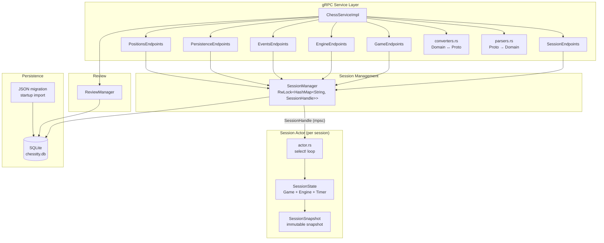

# chesstty-server - Authoritative Chess Game Server

The gRPC server that owns all game state. Manages sessions via the actor model, validates moves, controls Stockfish engines, manages timers, and broadcasts events to connected clients.

## Architecture

The server follows an **actor-per-session** architecture. Each game session runs as an isolated async task that owns all mutable state, communicating exclusively through channels.



## Module Structure

```
server/src/
├── main.rs                    # Server startup, tracing init, gRPC server bind
├── config.rs                  # DB path + legacy JSON migration source resolution
├── persistence/
│   ├── mod.rs                 # PersistenceError, re-exports, ID generators
│   ├── traits.rs              # Async repository interfaces
│   ├── json_store.rs          # Shared JSON utilities (migration + tests)
│   ├── session_store.rs       # Legacy JSON session store (tests/migration)
│   ├── finished_game_store.rs # Legacy JSON finished game store (tests/migration)
│   ├── position_store.rs      # Legacy JSON position store (tests/migration)
│   └── sqlite/
│       ├── mod.rs             # SQLite backend exports
│       ├── database.rs        # Pool setup, WAL mode, embedded migrations
│       ├── migrate_json.rs    # One-time JSON -> SQLite migration
│       ├── session_repo.rs    # SessionRepository impl
│       ├── position_repo.rs   # PositionRepository impl
│       ├── finished_game_repo.rs # FinishedGameRepository impl
│       ├── review_repo.rs     # ReviewRepository impl
│       └── advanced_repo.rs   # AdvancedAnalysisRepository impl
├── service/
│   ├── mod.rs                 # ChessServiceImpl (delegates to endpoint handlers)
│   ├── converters.rs          # Domain ↔ Proto type conversions
│   ├── parsers.rs             # Proto → Domain parsing with validation
│   └── endpoints/
│       ├── session.rs         # CreateSession, GetSession, CloseSession
│       ├── game.rs            # MakeMove, GetLegalMoves, Undo, Redo, Reset
│       ├── engine.rs          # SetEngine, StopEngine, Pause, Resume
│       ├── events.rs          # StreamEvents (gRPC server streaming)
│       ├── persistence.rs     # Suspend, Resume, List, Delete suspended
│       ├── positions.rs       # SavePosition, ListPositions, DeletePosition
│       └── review.rs          # Review + advanced analysis endpoints
├── review/
│   ├── mod.rs                 # ReviewManager (job queue, worker pool, public API)
│   ├── worker.rs              # ReviewWorker (per-ply engine analysis loop)
│   ├── types.rs               # GameReview, PositionReview, MoveClassification
│   ├── store.rs               # Review persistence helpers
│   └── advanced/              # Advanced analysis compute/cache/store
└── session/
    ├── mod.rs                 # SessionManager (session lifecycle + stores)
    ├── actor.rs               # Session actor loop (select!, command/event handling)
    ├── commands.rs            # SessionCommand enum, SessionError, EngineConfig, LegalMove
    ├── events.rs              # SessionEvent enum, UciLogEntry, UciDirection
    ├── handle.rs              # SessionHandle (cheap clone, mpsc + oneshot)
    ├── snapshot.rs            # SessionSnapshot, MoveRecord, TimerSnapshot
    └── state.rs               # SessionState (mutable state), TimerState
```

## Actor Model

### Session Lifecycle

```
CreateSession
    │
    ▼
SessionManager::create_session()
    │── Generate UUID
    │── Create Game from FEN (or default)
    │── Create mpsc channel (commands) + broadcast channel (events)
    │── Create SessionState
    │── tokio::spawn(run_session_actor)
    │── Store SessionHandle in HashMap
    └── Return initial SessionSnapshot

CloseSession / SuspendSession
    │
    ▼
SessionManager removes handle from HashMap
    │── handle.shutdown()
    │── Actor sends EngineCommand::Quit to Stockfish
    │── Actor loop breaks
    └── Actor task exits
```

### Actor Loop (select! with biased priority)

The actor runs a `tokio::select! { biased; }` loop with three branches:

```rust
loop {
    tokio::select! {
        biased;

        // 1. Commands from gRPC endpoints (highest priority)
        cmd = cmd_rx.recv() => { handle_command(cmd) }

        // 2. Engine events from Stockfish process
        event = state.next_engine_event() => { handle_engine_event(event) }

        // 3. Timer tick (100ms, only when timer is active)
        _ = timer_interval.tick(), if state.timer_active() => { tick_timer() }
    }
}
```

**Priority ordering matters**: Commands are processed first so that user actions (like `Stop` or `Pause`) take effect before pending engine events.

### Command/Reply Pattern

Every command embeds a `oneshot::Sender` for its reply, creating a request/response pattern over channels:

```mermaid
sequenceDiagram
    participant Endpoint as gRPC Endpoint
    participant Handle as SessionHandle
    participant SA as Session Actor

    Endpoint->>Handle: make_move(mv)
    Handle->>Handle: create oneshot reply channel
    Handle->>SA: send SessionCommand::MakeMove { mv, reply }
    Note over SA: state.apply_move(mv)
    Note over SA: event_tx.send(StateChanged)
    Note over SA: maybe_auto_trigger()
    SA-->>Handle: reply via oneshot (SessionSnapshot)
    Handle-->>Endpoint: Result&lt;SessionSnapshot&gt;
```

### Engine Event Handling

| Engine Event    | Actor Response                                                                                                                       |
| --------------- | ------------------------------------------------------------------------------------------------------------------------------------ |
| `BestMove(mv)`  | Convert UCI castling notation, validate legality, apply move, broadcast `StateChanged`, call `maybe_auto_trigger()` for EvE chaining |
| `Info(info)`    | Convert to `EngineAnalysis`, store in state, broadcast `EngineThinking`                                                              |
| `RawUciMessage` | Broadcast as `UciMessage` for the debug panel                                                                                        |
| `Ready`         | Log only (readyok/uciok)                                                                                                             |
| `Error(msg)`    | Log error, broadcast `Error` event                                                                                                   |

### Auto-Trigger Logic

After every state mutation, `maybe_auto_trigger()` checks if the engine should calculate a move:

```
should_auto_trigger_engine() =
    !engine_thinking
    AND phase == Playing
    AND engine is Some
    AND game status == Ongoing
    AND (mode == EngineVsEngine
         OR (mode == HumanVsEngine AND current_turn != human_side))
```

Search parameters scale with skill level:

| Skill Level | Search Parameter |
| ----------- | ---------------- |
| 0-3         | `depth 4`        |
| 4-7         | `depth 8`        |
| 8-12        | `movetime 500`   |
| 13-17       | `movetime 1000`  |
| 18-20       | `movetime 2000`  |

## Service Layer

### Endpoint Organization

`ChessServiceImpl` implements the tonic `ChessService` trait and delegates each RPC to a specialized endpoint handler. Each handler holds an `Arc<SessionManager>`:

| Handler                | RPCs                                                                                                                       | Responsibility                       |
| ---------------------- | -------------------------------------------------------------------------------------------------------------------------- | ------------------------------------ |
| `SessionEndpoints`     | Create, Get, Close                                                                                                         | Session lifecycle                    |
| `GameEndpoints`        | MakeMove, GetLegalMoves, Undo, Redo, Reset                                                                                 | Game actions                         |
| `EngineEndpoints`      | SetEngine, StopEngine, Pause, Resume                                                                                       | Engine + pause control               |
| `EventsEndpoints`      | StreamEvents                                                                                                               | gRPC server streaming                |
| `PersistenceEndpoints` | Suspend, Resume, List, Delete, SaveSnapshot                                                                                | Session persistence                  |
| `PositionsEndpoints`   | Save, List, Delete                                                                                                         | Saved positions                      |
| `ReviewEndpoints`      | ListFinishedGames, EnqueueReview, GetReviewStatus, GetGameReview, ExportReviewPgn, DeleteFinishedGame, GetAdvancedAnalysis | Post-game review + advanced analysis |

### Proto Boundary

Domain types and proto types are kept completely separate:

- **`converters.rs`** - Transforms domain types (`SessionSnapshot`, `GamePhase`, etc.) into proto types for gRPC responses
- **`parsers.rs`** - Parses proto types from gRPC requests into domain types with validation (e.g., square strings -> `cozy_chess::Square`)

No proto types leak into the session or game logic.

## Timer Management

The server owns all timer state. The client only receives `TimerSnapshot` values for rendering.

```
TimerState {
    white_remaining_ms: u64,    // Saturating subtraction on tick
    black_remaining_ms: u64,
    active_side: Option<PlayerSide>,  // None when stopped
    last_tick: Instant,         // For elapsed time calculation
}
```

- **start(side)** - Begin timing for a side, record `last_tick`
- **stop()** - Flush elapsed time, set `active_side = None`
- **switch_to(side)** - Flush current side, switch, reset `last_tick`
- **tick()** - Called every 100ms; returns `true` if flag fell (time expired)

On flag fall, the actor transitions to `GamePhase::Ended` with reason "Time expired".

## Persistence

### Storage Backend

Production persistence is SQLite (`chesstty.db`) via `sqlx` repositories. Legacy JSON files are used as a migration source at startup and as lightweight test fixtures.

### Session Persistence (Suspend/Resume)

Suspended sessions are stored in the SQLite `suspended_sessions` table:

```json
{
  "suspended_id": "1704067200-abc123",
  "fen": "rnbqkb1r/pppppppp/5n2/8/4P3/8/PPPP1PPP/RNBQKBNR w KQkq - 1 2",
  "side_to_move": "white",
  "move_count": 2,
  "game_mode": "HumanVsEngine:White",
  "human_side": "white",
  "skill_level": 10,
  "created_at": 1704067200
}
```

On suspend: snapshot state, insert/update SQLite row, close the live session. On resume: load row, create a new session from the saved FEN and mode, then delete the suspended row.

### Position Library

Saved positions are stored in the SQLite `saved_positions` table:

```json
{
  "position_id": "1704067200-def456",
  "name": "Italian Opening",
  "fen": "r1bqkbnr/pppp1ppp/2n5/4p3/2B1P3/5N2/PPPP1PPP/RNBQK2R b KQkq - 4 4",
  "is_default": true,
  "created_at": 1704067200
}
```

Default positions (`is_default: true`) are seeded from the `defaults/` directory on first run and cannot be deleted.

### Finished Games

When a session with `GamePhase::Ended` is closed, the move history is automatically saved in SQLite (`finished_games` + related move rows):

```json
{
  "game_id": "game_1704067200000",
  "start_fen": "rnbqkbnr/pppppppp/8/8/8/8/PPPPPPPP/RNBQKBNR w KQkq - 0 1",
  "result": "WhiteWins",
  "result_reason": "Checkmate",
  "game_mode": "HumanVsEngine:White",
  "move_count": 42,
  "moves": [{ "from": "e2", "to": "e4", "san": "e4", "fen_after": "..." }],
  "created_at": 1704067200
}
```

### Review Results

Reviews are stored in SQLite (`reviews` + related per-position rows):

```json
{
  "game_id": "game_1704067200000",
  "status": "Complete",
  "positions": [
    {
      "ply": 0,
      "fen": "...",
      "played_san": "e4",
      "classification": "Best",
      "cp_loss": 0
    }
  ],
  "white_accuracy": 87.3,
  "black_accuracy": 72.1,
  "analysis_depth": 18
}
```

## Review System

The ReviewManager runs background engine analysis of completed games:

- **Job queue**: Bounded `mpsc(64)` channel with backpressure
- **Worker pool**: Configurable number of workers (default 1), each spawning its own Stockfish process
- **Per-ply analysis**: For each move, evaluates the position before and after, computes centipawn loss, and classifies the move (Best/Excellent/Good/Inaccuracy/Mistake/Blunder)
- **Crash recovery**: Partial results persist after each ply; re-enqueuing resumes from last analyzed position
- **Duplicate prevention**: An `RwLock<HashSet>` tracks in-flight game IDs

### Worker Analysis Pipeline

For each move (ply) in a finished game, the worker performs this sequence:

#### 1. Evaluate Position Before Move

- Set engine position to the FEN **before** the move
- Search at fixed depth (configurable, typically 18 plies)
- Extract:
  - **best_eval** - Position evaluation from the moving side's perspective
  - **best_move_uci** - Engine's recommended move
  - **pv** - Principal variation (best line of play)

#### 2. Evaluate Position After Move

The handling differs for terminal vs ongoing positions:

**Ongoing positions:**

- Set engine position to FEN **after** the move
- Search at same depth
- Extract **played_eval** (from opponent's perspective)

**Terminal positions (checkmate/stalemate):**

- Skip engine call (Stockfish returns `bestmove (none)` which parser can't handle)
- Infer eval from game status:
  - Checkmate: `Mate(0)` - the side to move is checkmated
  - Stalemate: `Centipawns(0)` - draw by stalemate

This special handling prevents parser errors while correctly representing the position.

#### 3. Compute Centipawn Loss

This is where perspective matters carefully:

```
best_eval ← from moving side's perspective (before move)
played_eval ← from opponent's perspective (after move)

// Convert to moving side's perspective
played_eval_from_mover = -played_eval

// Loss is always non-negative
cp_loss = max(0, best_cp - played_cp)
```

**Example**: White plays e4

1. Before: Engine says White is +50 (White's perspective) → best_cp = 50
2. After: Engine says White is -20 (Black's perspective) → played_cp = 20 (from White's perspective)
3. Loss: max(0, 50 - 20) = 30 cp

The `max(0, ...)` clamp ensures cp_loss is never negative (a move can't simultaneously lose material AND gain position).

#### 4. Classify Move

Classification is deterministic based on cp_loss and forced move detection:

```rust
pub fn from_cp_loss(cp_loss: i32, is_forced: bool) -> MoveClassification {
    if is_forced { return Self::Forced; }
    match cp_loss {
        i if i <= 0 => Self::Best,         // 0 or better (rare)
        1..=10 => Self::Excellent,
        11..=30 => Self::Good,
        31..=100 => Self::Inaccuracy,
        101..=300 => Self::Mistake,
        _ => Self::Blunder,
    }
}
```

**Forced move detection**: Uses `cozy_chess` to generate all legal moves; if count ≤ 1, the move is forced.

#### 5. Store Evaluations (Normalized to White)

For consistency in storage, evaluations are always stored from White's perspective:

**For White's moves:**

- `eval_before = best_eval` (already from White's perspective)
- `eval_after = -played_eval` (negate to get White's perspective)

**For Black's moves:**

- `eval_before = -best_eval` (negate to get White's perspective)
- `eval_after = played_eval` (already from White's perspective, since it's Black's perspective of the resulting position)

This allows the UI to consistently interpret values as "positive = White advantage" regardless of whose move it was.

### Accuracy Calculation

After all plies are analyzed, accuracy is computed separately for each side:

```rust
pub fn compute_accuracy(positions: &[PositionReview], is_white: bool) -> f64 {
    // Filter to moves by this side
    let side_positions: Vec<_> = positions
        .iter()
        .filter(|p| is_white_ply(p.ply) == is_white)
        .collect();

    if side_positions.is_empty() { return 100.0; }

    // Average centipawn loss (with cap at 1000 to prevent mate outliers)
    let avg_cp_loss = side_positions
        .iter()
        .map(|p| (p.cp_loss as f64).min(1000.0))
        .sum::<f64>() / side_positions.len() as f64;

    // Exponential formula
    let accuracy = 103.1668 * (-0.006 * avg_cp_loss).exp() - 3.1668;
    accuracy.clamp(0.0, 100.0)
}
```

**Key details:**

- **Ply filtering**: Odd plies (1, 3, 5, ...) are White's moves; even plies (2, 4, 6, ...) are Black's moves
- **Centipawn cap at 1000**: Prevents mate scores (which convert to ±20000+ cp) from skewing the average. This handles cases where a move loses a game with mate-in-N (which should count as "very bad" but not infinitely bad).
- **Exponential formula**: Calibrated so that typical accuracy values match chess.com/lichess standards:
  - 0 cp loss → ~100%
  - 10 cp loss → ~94%
  - 35 cp loss → ~80%
  - 100 cp loss → ~54%
- **Clamped to [0, 100]**: Even with extreme cp_loss, accuracy is bounded

**Edge cases:**

- Empty game (no moves) → 100% accuracy
- Mate positions with high cp_loss → Capped at 1000, so max contribution is 1000/count
- Empty position list for one side → 100% accuracy

### Rounding and Precision

**Floating-point handling:**

- `exp()` function uses full f64 precision; no pre-rounding
- Final accuracy is formatted to 1 decimal place for display
- Centipawn values are stored as i32 (integer)
- Evaluations use `AnalysisScore` enum (Centipawns(i32) or Mate(i32))

**Mate score conversion to centipawns:**

- `Mate(N)` where N > 0 → `20000 - (N as i32 * 500)` (converts to high positive score)
- `Mate(-N)` where N > 0 → `-(20000 - (N as i32 * 500))` (converts to negative)
- This ensures mate-in-1 (M1) > mate-in-2 (M2) in value, but both are extremely high/low

**Terminal position handling:**

- Checkmate positions return `Mate(0)` (immediate mate) from the side-to-move's perspective
- Stalemate returns `Centipawns(0)` (draw)

### Persistence and Crash Recovery

Reviews are stored with positions written **after every ply**:

```json
{
  "game_id": "game_123",
  "status": { "Analyzing": { "current_ply": 15, "total_plies": 42 } },
  "positions": [
    /* 15 completed positions */
  ],
  "white_accuracy": null,
  "black_accuracy": null,
  "total_plies": 42,
  "analyzed_plies": 15
}
```

On worker crash or restart:

1. Load the partial review
2. Check `analyzed_plies` (15)
3. Resume from ply 16
4. Skip initial 15 iterations

On successful completion:

1. Compute accuracy for both sides
2. Set status to "Complete"
3. Record `completed_at` timestamp
4. Persist final review

## Configuration

```bash
# Log level (defaults to "info")
RUST_LOG=debug cargo run -p chesstty-server

# SQLite DB path (preferred runtime config)
CHESSTTY_DB_PATH=/path/to/chesstty.db cargo run -p chesstty-server

# Legacy JSON migration source directory (optional)
CHESSTTY_DATA_DIR=/path/to/legacy-json cargo run -p chesstty-server
```

Server binds to `[::1]:50051` (IPv6 localhost).

## Error Handling

All errors are returned as gRPC `Status` codes:

| Status Code        | Scenarios                                           |
| ------------------ | --------------------------------------------------- |
| `NOT_FOUND`        | Session or position doesn't exist                   |
| `INVALID_ARGUMENT` | Illegal move, invalid FEN, bad square format        |
| `INTERNAL`         | Lock poisoned, engine spawn failure, channel closed |

## Testing

```bash
cargo test -p chesstty-server
```

Tests are co-located with source code:

- **`actor.rs`** - Actor lifecycle, make_move via actor, subscribe, pause/resume, shutdown
- **`state.rs`** - Snapshot creation, apply_move, auto-trigger logic, timer ticking
- **`persistence/`** - Save/load roundtrip, list, delete for sessions, finished games, and positions
- **`converters.rs`** - Domain -> proto conversion correctness
- **`parsers.rs`** - Square/move parsing, valid and invalid inputs
