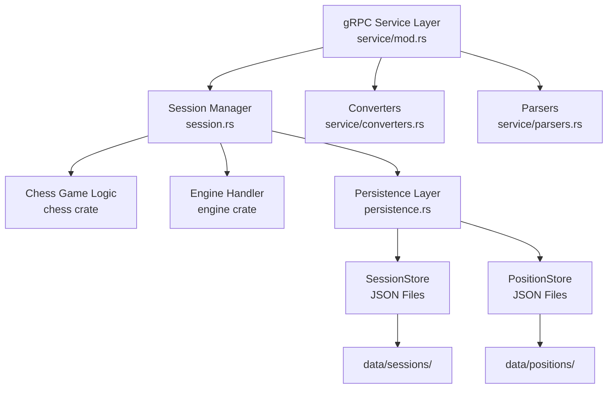
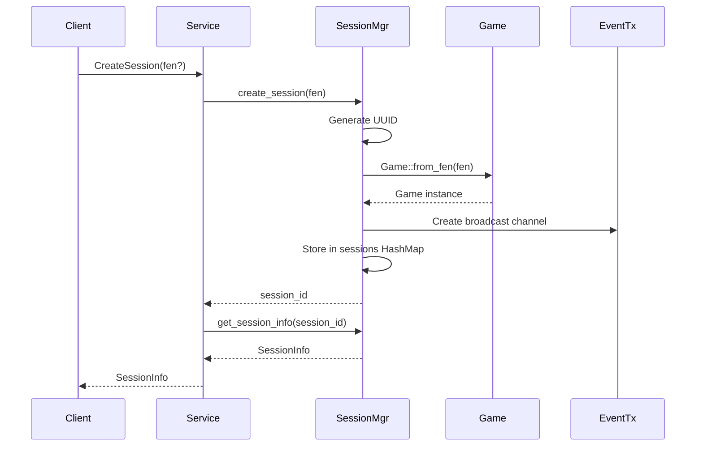
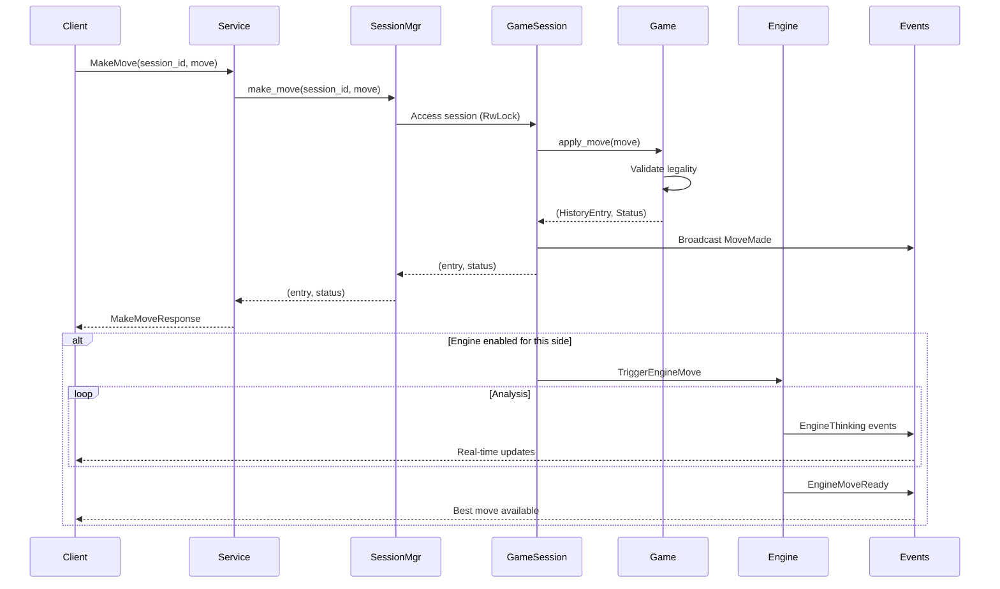

# chesstty-server - Authoritative Chess Server

gRPC server providing authoritative game state management, move validation, and Stockfish engine integration.

## Architecture

### High-Level Component Diagram



### Module Structure

```
server/src/
├── main.rs                         # Server startup, tracing configuration
├── service/
│   ├── mod.rs                      # ChessServiceImpl (delegates to domain logic)
│   ├── converters.rs               # Domain model → Proto conversions + tests
│   └── parsers.rs                  # Proto → Domain model parsing + tests
├── session.rs                      # SessionManager (core business logic) + tests
└── persistence.rs                  # SessionStore, PositionStore (JSON I/O) + tests
```

## Key Abstractions

### SessionManager

**Responsibility:** Manages lifecycle of game sessions and coordinates between chess logic, engine, and persistence.

**Core Methods:**

```rust
impl SessionManager {
    // Session lifecycle
    pub async fn create_session(&self, fen: Option<String>) -> Result<String>;
    pub async fn get_session_info(&self, session_id: &str) -> Result<SessionInfo>;
    pub async fn close_session(&self, session_id: &str) -> Result<()>;

    // Game actions
    pub async fn make_move(&self, session_id: &str, mv: Move)
        -> Result<(HistoryEntry, GameStatus)>;
    pub async fn get_legal_moves(&self, session_id: &str, from: Option<Square>)
        -> Result<Vec<Move>>;
    pub async fn undo_move(&self, session_id: &str) -> Result<()>;
    pub async fn redo_move(&self, session_id: &str) -> Result<()>;
    pub async fn reset_game(&self, session_id: &str, fen: Option<String>) -> Result<()>;

    // Engine control
    pub async fn set_engine(&self, session_id: &str, enabled: bool, skill: u8,
        threads: Option<u32>, hash_mb: Option<u32>) -> Result<()>;
    pub async fn trigger_engine_move(&self, session_id: &str, movetime: Option<u64>)
        -> Result<()>;
    pub async fn stop_engine(&self, session_id: &str) -> Result<()>;

    // Event streaming
    pub async fn subscribe_events(&self, session_id: &str)
        -> Result<broadcast::Receiver<SessionEvent>>;

    // Persistence
    pub async fn suspend_session(&self, session_id: &str, game_mode: String,
        human_side: Option<String>, skill: u8) -> Result<String>;
    pub fn list_suspended(&self) -> Result<Vec<SuspendedSessionData>>;
    pub async fn resume_suspended(&self, suspended_id: &str)
        -> Result<(String, SuspendedSessionData)>;
    pub fn delete_suspended(&self, suspended_id: &str) -> Result<()>;

    // Position management
    pub fn save_position(&self, name: String, fen: String) -> Result<String>;
    pub fn list_positions(&self) -> Result<Vec<SavedPositionData>>;
    pub fn delete_position(&self, position_id: &str) -> Result<()>;
}
```

**State Management:**

```rust
pub struct SessionManager {
    sessions: Arc<RwLock<HashMap<String, Arc<RwLock<GameSession>>>>>,
    session_store: SessionStore,
    position_store: PositionStore,
}
```

- **Thread-safe:** Uses `RwLock` for concurrent client access
- **Session isolation:** Each session has independent state
- **Event broadcasting:** `tokio::broadcast` for real-time updates

### GameSession

**Responsibility:** Per-session state including game, engine handle, and event broadcasting.

**Structure:**

```rust
pub struct GameSession {
    id: String,
    game: Arc<RwLock<Game>>,                        // Chess game state
    engine_cmd_tx: Option<mpsc::Sender<EngineCommand>>,  // Send to engine task
    engine_task: Option<JoinHandle<()>>,            // Per-session async engine handler
    skill_level: u8,                                // Stockfish skill (0-20)
    engine_enabled: bool,
    event_tx: broadcast::Sender<SessionEvent>,      // Broadcast to all subscribers
}
```

**Event Handler Pattern:**

Each session spawns an async task to handle engine events:

```rust
tokio::spawn(async move {
    while let Some(event) = engine_event_rx.recv().await {
        match event {
            EngineEvent::Info(info) => {
                event_tx.send(SessionEvent::EngineThinking { info });
            }
            EngineEvent::BestMove(mv, eval) => {
                event_tx.send(SessionEvent::EngineMoveReady {
                    best_move: mv,
                    evaluation: eval
                });
            }
            // ... handle other events
        }
    }
});
```

## Data Flow

### Session Creation



### Move Making with Engine



## Service Layer Organization

The service layer is split for clarity:

### service/mod.rs

**ChessServiceImpl** delegates to SessionManager:

```rust
#[tonic::async_trait]
impl ChessService for ChessServiceImpl {
    async fn make_move(&self, request: Request<MakeMoveRequest>)
        -> Result<Response<MakeMoveResponse>, Status> {
        let req = request.into_inner();
        let mv = parse_move_repr(&req.r#move.ok_or(...)?)?;  // Use parsers

        let (entry, _) = self.session_manager
            .make_move(&req.session_id, mv)
            .await
            .map_err(|e| Status::invalid_argument(e))?;

        let info = self.session_manager
            .get_session_info(&req.session_id)
            .await?;

        Ok(Response::new(MakeMoveResponse {
            session_info: Some(convert_session_info_to_proto(info)),  // Use converters
            move_record: Some(convert_history_entry_to_proto(&entry)),
        }))
    }
}
```

### service/converters.rs

Domain model → Proto conversions:

```rust
pub fn convert_session_info_to_proto(info: SessionInfo) -> chess_proto::SessionInfo;
pub fn convert_history_entry_to_proto(entry: &HistoryEntry) -> MoveRecord;
pub fn convert_game_status(status: CozyGameStatus) -> GameStatus;
pub fn convert_session_event_to_proto(event: SessionEvent, session_id: &str)
    -> Option<GameEvent>;
```

### service/parsers.rs

Proto → Domain model parsing with validation:

```rust
pub fn parse_move_repr(mv: &MoveRepr) -> Result<Move, Status>;
pub fn parse_square_grpc(s: &str) -> Result<Square, Status>;
pub fn parse_piece_grpc(c: char) -> Result<Piece, Status>;
pub fn format_move_san(mv: &Move) -> String;
```

## Persistence

### Session Persistence

Suspended sessions stored in `data/sessions/*.json`:

```json
{
  "suspended_id": "550e8400-e29b-41d4-a716-446655440000",
  "fen": "rnbqkb1r/pppppppp/5n2/8/4P3/8/PPPP1PPP/RNBQKBNR w KQkq - 1 2",
  "game_mode": "HumanVsEngine",
  "human_side": "white",
  "skill_level": 10,
  "move_count": 2,
  "side_to_move": "black",
  "created_at": 1704067200
}
```

**Operations:**
- `SessionStore::save(data)` - Write to JSON file
- `SessionStore::load(id)` - Read from JSON file
- `SessionStore::list()` - List all suspended sessions
- `SessionStore::delete(id)` - Remove JSON file

### Position Library

Saved positions in `data/positions/*.json`:

```json
{
  "position_id": "italian-opening",
  "name": "Italian Opening",
  "fen": "r1bqkbnr/pppp1ppp/2n5/4p3/2B1P3/5N2/PPPP1PPP/RNBQK2R b KQkq - 4 4",
  "is_default": true,
  "created_at": 1704067200
}
```

**Default positions** (is_default=true) are seeded on first run and cannot be deleted.

## Concurrency Model

### Session Access

```rust
// Multiple concurrent readers allowed
let sessions = self.sessions.read().await;
let session = sessions.get(session_id)?;
let session_guard = session.read().await;
// Read game state...
```

```rust
// Exclusive writer for mutations
let sessions = self.sessions.read().await;
let session = sessions.get(session_id)?;
let mut session_guard = session.write().await;
// Modify game state...
```

### Engine Parallelism

Each session has an independent engine task:

```rust
// Per-session engine handler (async task)
tokio::spawn(async move {
    while let Some(cmd) = engine_cmd_rx.recv().await {
        match cmd {
            EngineCommand::Go(params) => engine.go(params).await,
            EngineCommand::Stop => engine.stop().await,
        }
    }
});
```

- **Isolation:** Engines don't block each other
- **Multithreading:** Stockfish uses configurable thread count
- **Event-driven:** Non-blocking communication

## Testing

### Unit Tests

Inline tests in each module:

**session.rs** (5 tests):
- test_create_session
- test_make_move
- test_undo_redo
- test_close_session
- test_get_legal_moves

**persistence.rs** (11 tests):
- test_save_and_load_roundtrip
- test_list_suspended_sessions
- test_default_positions_seeded
- test_cannot_delete_default_positions
- ... etc

**service/converters.rs** (2 tests):
- test_convert_game_status
- test_convert_session_info_basic

**service/parsers.rs** (5 tests):
- test_parse_square_grpc_valid/invalid
- test_parse_move_repr_simple/with_promotion
- test_format_move_san

Run: `cargo test --package chesstty-server`

### Integration Tests

**TODO:** Add `tests/` directory with:
- gRPC endpoint tests with test server helper
- Session lifecycle integration tests
- Engine integration tests

## Configuration

### Tracing

Logs to console with structured output:

```bash
# Set log level
RUST_LOG=debug cargo run --bin chesstty-server

# Log format: INFO server::session: Creating session fen=None
```

### Engine Settings

Stockfish detected from PATH automatically:

```bash
# Override Stockfish path
STOCKFISH_PATH=/path/to/stockfish cargo run --bin chesstty-server
```

### Server Address

Hardcoded to `[::1]:50051` (IPv6 localhost):

```rust
// main.rs
let addr = "[::1]:50051".parse()?;
```

Change to `0.0.0.0:50051` for external access.

## Error Handling

All errors return gRPC Status:

```rust
// Not found
Status::not_found(format!("Session not found: {}", session_id))

// Invalid argument
Status::invalid_argument("Illegal move: knight can't move like that")

// Internal error (shouldn't happen)
Status::internal(format!("Failed to acquire lock: {}", err))
```

## Performance Considerations

### Memory

- Each session: ~5KB (game state + history)
- Event channels: 100-event buffer per session
- Typical: 10-50 concurrent sessions = ~50-250KB

### CPU

- Move validation: <1ms per move
- Engine analysis: CPU-bound (configurable threads)
- Event broadcasting: Negligible overhead

### Scalability

Current design handles ~1000 concurrent clients on modest hardware.

For higher load:
- Add session sharding across multiple servers
- Use Redis for session storage instead of in-memory
- Add load balancer in front of multiple server instances

## Security Considerations

**Current:** No authentication - suitable for local/trusted use only

**For Production:**

1. **TLS:** Enable TLS certificates for encrypted transport
2. **Auth:** Add JWT/mTLS/API key authentication
3. **Rate Limiting:** Prevent abuse (max moves/second per client)
4. **Input Validation:** Already done server-side (FEN, moves)
5. **Audit Logging:** Log all game actions for replay/analysis

## Related Documentation

- [Protocol Definitions](../proto/README.md)
- [Client Library](../chess-client/README.md)
- [Chess Logic](../chess/README.md)
- [Engine Integration](../engine/README.md)
